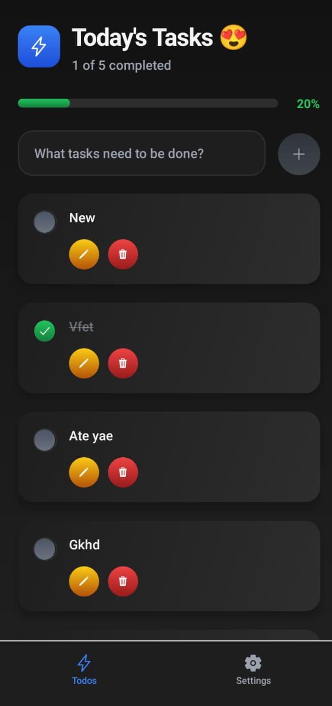
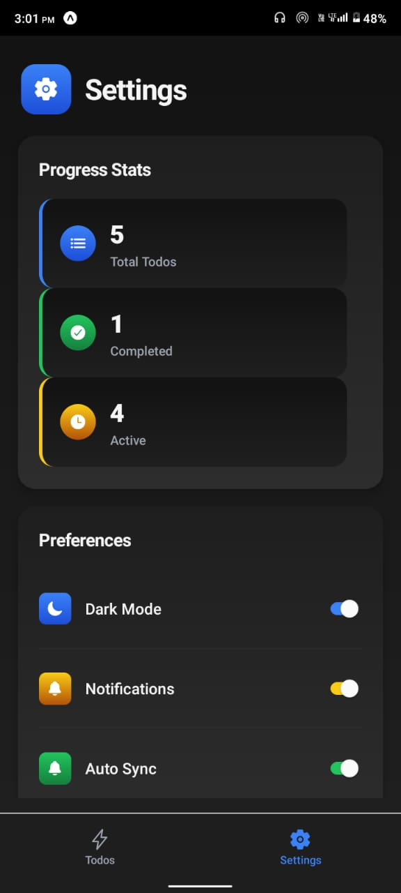

<h1 align='center'> ✅ Todo-App-RN </h1>

A **modern, full-featured Todo application** built with **React Native, Expo, and Convex backend**.This app demonstrates **best practices in UI/UX, state management, and real-time cloud synchronization**.

---

## ✨ Features

- ✍️ Add, edit, and delete todos  
- ✔️ Mark todos as completed  
- 🔄 Real-time updates with Convex backend  
- 🎨 Beautiful gradients and theming  
- 📊 Progress statistics dashboard  
- ⚙️ Preferences and settings page  
- 🚨 Danger zone for destructive actions  
- 📱 Responsive design for mobile devices  

---

## 📸 Screenshots

| Home Screen | Settings Screen |
|-------------|----------------|
|  |  |

---

## Getting Started

### Prerequisites
- Node.js & npm
- Expo CLI (`npm install -g expo-cli`)
- Convex account & backend setup

### Installation

```bash
# Clone the repository
$ git clone https://github.com/ExploreInsight/Todo-App-RN.git
$ cd Todo-App-RN

# Install dependencies
$ npm install

# Set up Convex
# Add your Convex URL to .env or app.json as EXPO_PUBLIC_CONVEX_URL
```

### Running the App

```bash
# Start the Expo development server
$ npm start

# Or
$ expo start
```

Scan the QR code with your Expo Go app or run on an emulator.

## Project Structure

```
app.json
assets/
  fonts/
  images/
  styles/
components/
convex/
hooks/
app/
  _layout.tsx
  (tabs)/
    _layout.tsx
    index.tsx
    settings.tsx
```

## Technologies Used
- React Native
- Expo
- Convex
- TypeScript
- Expo Router

## Customization
- Update theme colors in `hooks/useTheme.tsx`
- Modify styles in `assets/styles/`
- Add new features in `components/`

## License

This project is licensed under the MIT License.

## Author
Chirag

